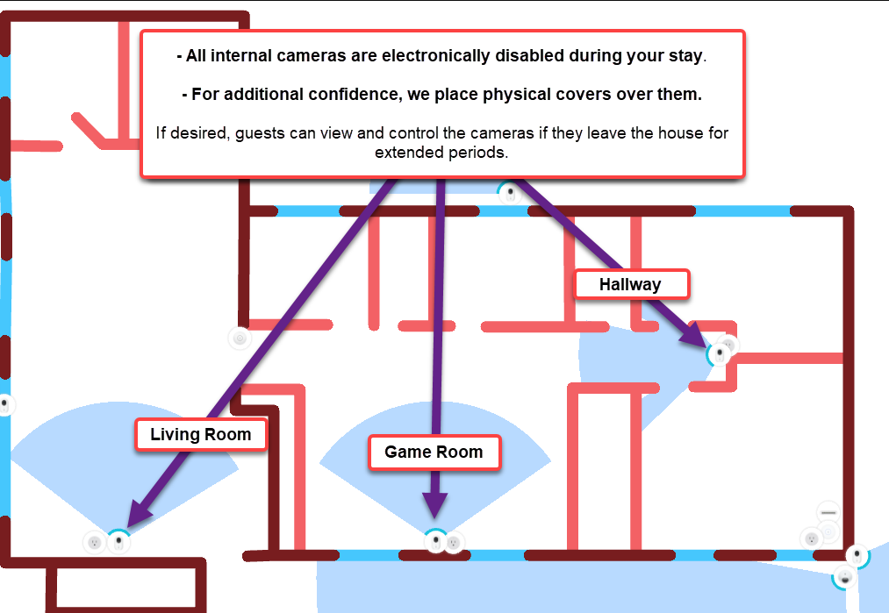

Welcome to Golden Clouds! Please take 5 minutes to read this **before** your arrival so that you are prepared ([para español, vaya aquí](https://goldenclouds-dvlup-com.translate.goog/?_x_tr_sl=en&_x_tr_tl=es&_x_tr_hl=en)).

Please bookmark this page, it contains very important information about the property, amenities, technology (e.g., Wi-Fi, cameras), and other "pro-tips" that will make your experience as pleasurable as possible. Please carefully read anything that says "warning".

First, to help you get excited for your stay, [here's a 30 second video at sunset](https://youtu.be/wHkB9e4JbyI):

### Table of Contents

- [Contacts](#contacts)
- [Check-in](#check-in)
  - [Gated Entrance and Keys](#gated-entrance-and-keys)
  - [Key Operation](#key-operation)
- [Check-out](#check-out)
- [Rooms and Amenities](#rooms-and-amenities)
- [Tips](#tips)
  - [Night-time](#night-time)
  - [Property Boundary](#property-boundary)
  - [Pets](#pets)
- [Onsite Technology](#onsite-technology)
  - [Solar Power and Battery Backup](#solar-power-and-battery-backup)
  - [Wi-Fi](#wi-fi)
    - [Wi-Fi Coverage](#wi-fi-coverage)
  - [Security Cameras](#security-cameras)
  - [Guest Camera Access](#guest-camera-access)
- [Food Recommendations](#food-recommendations)
  - [Notes](#notes)
- [Videos](#videos)
- [Photos](#photos)

> Click any item to jump to that section

## Contacts

If you have any questions or problems during your stay, here's how to get in touch.

* **Roy** - Local Property Manager
  * Whatsapp `+506 8501 7756` (for any problems or questions with the property)
* **Lance** and **Irina** - Host/Owner
  * Use AirBnb/Vrbo chat for fastest turnaround
  * Use email to share more robust information (lance @ dvlup . com)
* Emergency Services
  * Medical, Fire, Police `911`
  * Website [www.911.go.cr/](http://www.911.go.cr/)

> **➡️** Roy is an _excellent_ resource to ask about anything. He was a professional chef in New Jersey for many years, and is available for a night to make you dinner at the house. He can also provide a guided tour of the volcano, or a boat tour. He literally knows everyone in the area and is an all-around rockstar. 

## Check-in

### Gated Entrance and Keys

Attached to the front of the gate is a little lockbox that contains the keys. Enter the 4-digit combination and pull down the latch to open the box.

Once you have the gate fob and keys, here is how to use them:

### Key Operation

* The key works on all doors which are available to guests.
* The locks have double locking mechanism, you may need to turn the key 3 times to unlock & unlatch.
* You must enter through the kitchen door (the 2nd door in the carport, with screen door), as  The first door is a utility room and is inaccessible to guests.

## Check-out

Checking out is straightforward:

1. You can leave all the soiled laundry on the bed you used.
2. Close all the doors/windows you've opened and turn off any lights or fans that you turned on.
3. Turn of any Air Conditioners
4. Close the electronic gate after you've driven out 
5. Put the keys back in the lockbox, scramble the code and close to lock it.

This is our home, not just an "airbnb investment property", so we thank you for being considerate!

## Rooms and Amenities

Here is a list of all the major items & features of the property, with some guidance and recommendations.

* **Bathrooms**
  * Extra shampoo, conditioner and soap can be found in the bottom drawer of bathrooms. Extra towels and linens can be found in the cabinets of the rear bedroom.
  * The house uses a septic tank, please do not flush anything extra except the toilet paper we supply (it's made for septic tanks).
    * > **⚠️** Non-toilet paper items like paper towels, sanitary items, etc, *will* result in a backup of the plumbing and is a quick way to ruin your stay. There's a wastebasket next to each toilet dedicated for these items and plenty of extra trash bags in case you want to empty it early (this is common practice in Costa Rica).
  * Every bathroom has a shower that has its own hot water boiler/tank, we recommend the main bathroom for showering. Water can get hot really fast, so start with a tiny bit of hot water, then add cold. Always test it before jumping in 🫠.
* **Back Patio**
  * There are two chair hammocks available above the game room cabinet. These hammock chairs hook into the rings in the overhead structure.
  * Full hammock. We do not yet have a dedicated place to hook this up to yet, please do not use this one.
* **Game Room**
  * Board games are located in the game room, in the game cabinet (you can open any new games).
  * There is an **Xbox One** available, but it is not hooked up. If you connect it to the TV, it is already configured to connect to the wifi, but you will need to sign in with your own Xbox account. This is a security concern, don't forget to sign out of your account before you leave.
* **Television & PC Hardware**
  * There is a 32" TV available with all the apps you might want (Netflix/Hulu/etc). This also has 3 HDMI inputs and can be used as an external monitor for your laptop (very common use case for digital nomads.
  * There is a bluetooth keyboard and mouse for use at the desk. You need to pull out the little piece of tape in front of the battery and then put it into pairing mode by pressing the bluetooth button for 4 seconds.
* **Yoga Room**
  * This room has yoga mats, ball, weights, and a mirror.
  * This room also doubles as a private office if you do not want to work in the living room with gorgeous view. The gameroom table can be moved in there to act as desktop, the living room desk is very heavy and should be moved.
  * There is LED ambiance lighting in this room. You can change the color and brightness using any of the remote controllers and/or through Home Assistant. The strip will automatically change at sunset and sunrise.
* **Kitchen**
  * The kitchen is at your disposal, here are a few important things to keep in mind
  * Be sure to clean up thoroughly when you’re done. Remember that you’re in a jungle, any dropped food or scraps will attract insects.
  * There is no garbage disposal, food scraps should be thrown out into the jungle instead of a trash bag. Go to the edge of the yard and throw the scraps downhill.
  * If you trip a breaker, you can find the panel in the yoga room.
  * Although Arenal water is very pure, the kitchen’s water has its own filter and hot water system.
    * For the fridge water dispense, since we don't know the duration between guests, so we recommend letting it run for at least 30 seconds to flush out the filter (it's used for the ice maker too).
* **Laundry**
  * Clothes washer and dryer are in the kitchen, behind the closet doors.
* **Trash**
  * The city of Arenal has trash service every week on Thursday morning (5AM-7AM)
  * The cleaning service will take care of any trash. However, if you are staying longer than average guest, you might need to take some bags out. Please only use the metal trash bin to the right of the gate, in this photo:
      * 
* **Off-limits Areas**
  * There are only two internal areas that are off-limits, both have an electronic key-coded door lock. These rooms are for maintenance and owner access only.
  * Owner's bedroom: This is the door facing the game room with an electronic lock.
  * Electrical and networking closet: This is the door in the living room with electronic lock. This is absolutely off-limits to unauthorized personnel, *you can die from touching the wrong thing in there*!
  * The external bodega (tool closet) is not a guest area, but if you do need a rake, shovel, or ladder for some reason, your door key will open it. However, we ask that you contact Roy for anything that requires these items, he will handle it.
* **Windows, Fans, Air Conditioners**
  * Arenal is always ~72 degrees (+/- 10) and comfortable year-round (22 Celsius, +/- 4).
  * Open the windows, patio door and turn on the ceiling fans to get an excellent whole-house breeze.
    * Each window has a screen next to it, insert the screen after opening the window
  * For the rare hot/humid times, there are two brand-new A/C units (bedroom and living room). Please do not forget it off when not in use or while the doors/windows are open. You can use smart timers, if you're familiar with the controls.
* **Jacuzzis**
  * The indoor and outdoor jacuzzi are not available for use. They are in the process of being removed (they're too old) and are disconnected.

## Tips

### Night-time

  * Sunset is absolutely breathtaking, grab a chair on the patio, a drink and watch the pastel color show. Use `#GoldenCloudsArenal` and `#NeuvoArenal` hashtags on social. Pro-tip: If you’re showering in the front bathroom at this time of day, slide open the window to get the view!
  * Keep the screen door closed if you’re on the patio. We have excellent, non-toxic pest control on the grounds, but you still don’t want a firefly beep-booping around the house while you’re trying to sleep.
  * At night, especially right after sunset, bright lights will attract insects. We recommend keeping the kitchen door closed if you have the bar/kitchen lights on. This will prevent finding a bunch of insects just outside the door in the morning.

> **➡️** The valley's bats can sometimes be annoying when they land on the roof in the early hours of the evening after the sun sets. You may hear them scuttling around, but there's no reason for concern. We mention this ahead of time because while some folks don't notice it, others do.

### Property Boundary

The property lines have a boundary marked by a wired fence, _please stay within these bounds for your safety and security_. For example, the lot down the hill has domesticated animals (cows), please do not climb over the fence to take photos as this is very dangerous and very steep.

You are free to walk on the road for as far as you'd like, this is a popular activity of many guests. It's a nice light-to-moderate exercise with several spots along the way to see the entire valley from different angles.

### Pets 

If you have pets with you, we strongly recommend initially having them on a leash while out in the backyard. This is for a few reasons:

* The fences will not keep an untrained or determined dog inside the property.
* Occasionally, a couple of the neighborhood's small dogs go on a field trip together. They pass through in a couple minutes. Although they may appear to be friendly, **do not feed** or engage with them, or they will not go away.

> **🐶** Since we don't know how your pet behaves; the property owners and Airbnb/Vrbo cannot assume responsiblility for your animal's actions. Thus, we strongly urge caution, leash your pet until you understand how it will act in these surroundings. Play it safe!

## Onsite Technology

The house has modern internet and security features. From high-speed fiber-optic internet, to automated lighting that changes colors through-out the day, you can rest and/or work from paradise.

### Solar Power and Battery Backup

We have a hybrid solar power system that will power the house through solar panels and a backup battery system. During strong storms, the power utility might go down for short periods of time.

During utility power outages:

* The 120v power outlets and appliances will be powered by solar and battery backup.
* The 240v appliances are also powered by a separate solar and battery backup system, this system has a smaller battery array, so I recommend not using the dryer during outages so you can use that evergy for hot water and air conditioners.
* There is a little UPS in the guest bedroom, it is on the nightstand and can be used for the very rare event the house batteries don't last long enough.

> **➡️** If there is no sun during the power outage, only the batteries will be powering the house.  If it's sunny, then the solar panels will be powering the house, but that is to a limit before it starts using the batteries for overages.  Consider being strategic during outages to get the most backup time, for example don't use the washer/dryer so you can have hot water throughout the night.

### Wi-Fi

This is the same kind of Wi-Fi that you’ve used at airports, hospitals, stadiums, etc. 

1. Connect to `Golden Clouds Guest` (no password).
2. Your device should automatically open the Terms of Service (ToS) web page, just like airports and coffee shops.
    - If this doesn't happen automatically, just open your browser and attempt go to any website.
3. Accept the ToS and you're done. Note that the lease runs out in 30 days, if you are staying longer, you will be redirected to the ToS again for another 30 days)

This what the captive portal's ToS acceptance page looks like:

- If you have trouble with the Wi-Fi, message Lance, he can fix it very quickly.
- If you would like a separate dedicated network (i.e., for work), Lance can set that up for you in just a couple minutes.
- If you require ethernet instead of wifi, please let Lance or Roy know ahead of time and we can provide a single guest-isolated line.

#### Wi-Fi Coverage

Here is the wifi coverage map (the actual coverage is much stronger, but this gives you an idea of the zones).

### Security Cameras

There are security cameras on the property, this is a fact of life in Costa Rica that you will find on many properties where there is no full-time tenant. **You have full control over the internal cameras during your stay.**

It is important that you read and understand this section, so that you can feel comfortable and confident with your privacy during your visit.

1. There are 4 external cameras (front/driveway, left, right and backyard), these are not operatable by or accesible to the guest.
2. All 3 internal cameras; *all are in full view of the guest**; `Living Room`, `Game Room` and `Hallway`. The guest has full control over these cameras, see the [Guest Camera Access section](#guest-camera-access) below.
    - 
3. IPrivacy Covers - These are in the **game room**, on the top shelf. They are made out of opaque material (painter's tape) and look like this:
    -  
4. Guest can access and enable or disable the cameras (see the [Guest Camera Access](#camera-access) section below). This might be something you want if you're away from the property for a large portion of the day.

> **⚠️** Please do not **unplug** or **reposition** any security devices without first coordinating with Lance, as this will trigger a security alert. This is a modern AI-managed security system that will send a 'tampering' alert if a device is powered off or repositoned unexpectedly. Any damage to security devices due to guest manipulation will submitted to AirCover for reimbursement.

### Guest Camera Access

We also provide you with access to the [Home Assistant] system for the house. This lets you access and control the house lighting, the camera's privacy mode, and more. This will be available to you between check-in until check-out.

1. Click this link => [Golden Clouds - Home Assistant](https://ha.goldenclouds.dvlup.com) and login:
    * **Username**: `guest`
    * **Password**: `provided-during-check-in`
    * *Note: If you are using your phone, the first time you open it, the site might recommend using the app instead... just click "no/cancel" and use the website instead.*
2. Operating **Privacy Mode**
    1. Click the little eye icon to enable or disable Privacy Mode
    2. Wait ~5 seconds for the mode to be applied to the device. In this screenshot, the camera on the left has Privacy Mode turned on.
      * 
      * 

If you have any questions or concerns, please *do not remain silent*! Voice your questions/concerns to Lance and he will address all your concerns... we want you to have an enjoyable stay and good communication is a major factor.

## Food Recommendations

There are so many amazing places to eat packed in just Nuevo Arenal's small town limits. It takes a whole week just to go to them all, so let me share our favorite places (stars are our rating):

- **El Corral BBQ** (⭐⭐⭐⭐⭐): [https://maps.app.goo.gl/vZkXCBSiJ6DmTyZQ7](https://maps.app.goo.gl/vZkXCBSiJ6DmTyZQ7)
  - This is hands-down, our absolute favorite place, we go there every-single-day.
- **Sea Salt** (⭐⭐⭐⭐⭐): [https://maps.app.goo.gl/anEPM5oTBbiP3Gm78](https://maps.app.goo.gl/anEPM5oTBbiP3Gm78)
  - This is a brand new place, very modern layout and menu. They have top-notch seafood options, but also some very good chicken and beef items, too.
- **Moya's Place** (⭐⭐⭐⭐): [https://maps.app.goo.gl/PyL9zM12X2yzDcyR7](https://maps.app.goo.gl/PyL9zM12X2yzDcyR7)
  - Great for quick lunch or dinner, right in the middle of town and has a great ambience
- **Gingerbread** (⭐⭐⭐⭐⭐): [https://maps.app.goo.gl/9MTPYuieNEBa29em7](https://maps.app.goo.gl/9MTPYuieNEBa29em7)
  - This place is a little more expensive than average, but the plates are HUGE and are meant to server many people. The tradition is you pick 2 or 3 plates, then everyone takes their share from it
- **Cafe Macadmaia** (⭐⭐⭐⭐): [https://maps.app.goo.gl/bW67DHDAdzQqeDzC8](https://maps.app.goo.gl/bW67DHDAdzQqeDzC8)
  - A local and visitor favorite. The patio has unparallel views of the lake. Their blended drinks are a must-try.
- **Los Platillos Voladores** (⭐⭐⭐⭐): [https://maps.app.goo.gl/PyL9zM12X2yzDcyR7](https://maps.app.goo.gl/PyL9zM12X2yzDcyR7)
  - Don't let the location's appearance fool you, her italian food and pizza is amazing.

### Notes
- You can always ask Roy for recommendations, he knows everyone and everything in the area (I'm lucky to have him as the property manager and as a friend).
- DOT NOT go to "The German Bakery", no matter how many signs on the highway you've seen or how colorful it looks. It is a tourist trap, with really bad food saftey practices. It is a lesson in "how to ruin your reputation and legacy", the owners have let it go and the staff don't care.
- If you are vegan, vegitarian, or gluten-free, there are plenty of menu options available for you at these locations. Although I can't speak directly to this, I have taken gluten-free vegan friends with me and they were happy with the options.

## Videos

Click the video thumbnail to watch on YouTube

- Patio Walk to Edge
  - 
- Drone Footage
  - 

## Photos

Here are some photos to prepare you for your visit:

